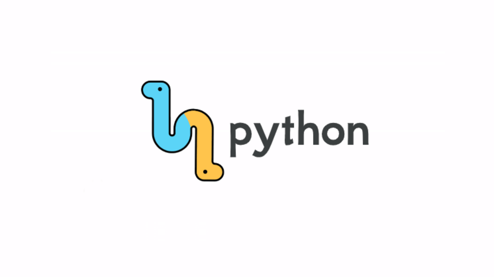
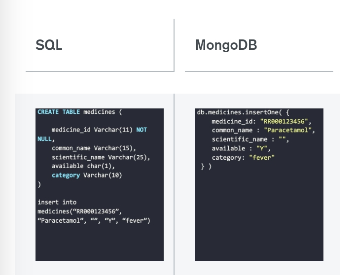

# Connect Python and MongoDB 


## About Python 
<p>
Python, the top programming language for data science, has always been a great match with MongoDB for building powerful applications.
</p>

<div>

</div>

## About MongoDB
<p>
MongoDB is a flexible, schema-less, JSON-style, document-based database. Here's a side-by-side comparison showing the insertion of a medicine into a pharmacy database in SQL and MongoDB:
</p>

<div>

</div>

## Connect Python and MongoDB Using PyMongo


<p>
PyMongo is very efficient for writing JSON data to MongoDB and allows the use of MongoDB queries in the Python code itself. We can retrieve data in a dictionary like syntax using PyMongo.
</p>

<i>
Install PyMongo easily using the pip/pip3 command:
</i>
<p>
<code>
pip install pymongo 
</code>
</p>


<p>
Using PyMongo, we can concurrently run multiple databases by specifying the right database name to the connection instance.
</p>

<code>
from pymongo import MongoClient <br>
client = pymongo.MongoClient('connection_string')
db = client['db_name']
</code>


## Connect Django and MongoDB Using MongoEngine
<p>
MongoEngine is an ORM layer on top of PyMongo. So, you still need PyMongo (>=3.4) on your system to use MongoEngine.
</p>

<p>
Using MongoEngine to connect Django and MongoDB gives you fields like ListField and DictField to handle huge unstructured JSON data.
</p>

<i>
First, install MongoEngine using:
</i>
<code>
pip install mongoengine
</code>
<p>
As we have seen in the previous section, while using PyMongo, we have to comment the DATABASES section in settings.py. Then, to use MongoEngine, add the following:
</p>

<code>
import mongoengine <br>
mongoengine.connect(db=db_name, host=hostname, username=username, password=pwd)
</code>
<p>
With MongoEngine, we have to define a schema in the models.py file of the Python application. MongoDB is schemaless. The schema is enforced only until application level, making any future changes fast and easy.
</p>

<p></p>

```geojson
{
  "type": "FeatureCollection",
  "features": [
    {
      "type": "Feature",
      "id": 1,
      "properties": {
        "ID": 0
      },
      "geometry": {
        "type": "Polygon",
        "coordinates": [
          [
              [-90,35],
              [-90,30],
              [-85,30],
              [-85,35],
              [-90,35]
          ]
        ]
      }
    }
  ]
}
```

